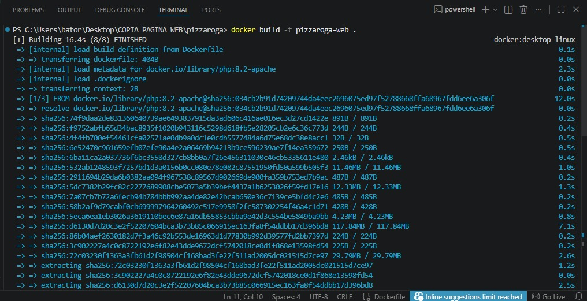
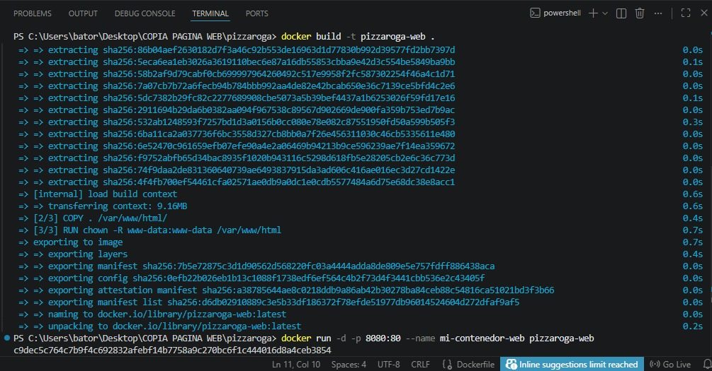

# Ventas Pizzeria - Pizza Róga 

Sitio web dinámico desarrollado para la pizzería artesanal **Pizza Róga** basada en Caacupé.

# Integrantes
*Luz Aguilera
*Axel Guillen
*Noemi Vargas


## Caracteristicas
* **Desarrollo:** PHP dinámico estructurado con arquitectura modular.
* **Contenedorización:** Despliegue empaquetado mediante Docker utilizando imágenes oficiales de PHP con Apache.
* **Automatización:** Cuenta con un script de despliegue automatizado en Windows (`deploy.bat`).

## Capturas de Docker
   
   

## Capturas de funcionamiento
    

## Requisitos e Instalacion
1. Clonar el repositorio.
2. Asegurarse de tener Docker Desktop ejecutándose.
3. Ejecutar el script automatizado en la terminal:
```bash
   ./deploy.bat