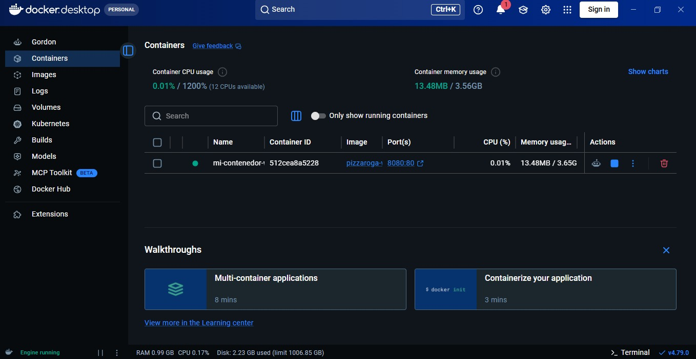
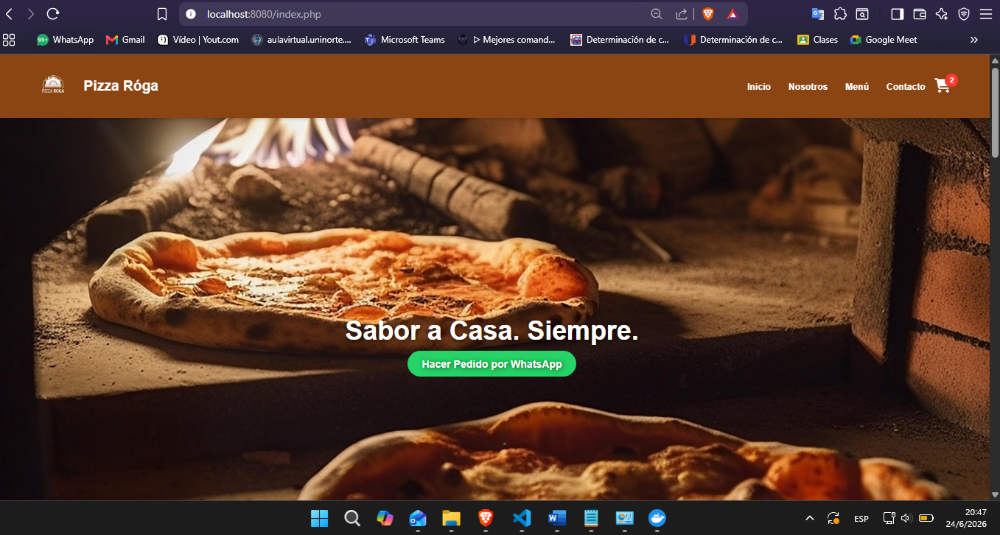

# Ventas Pizzeria - Pizza Róga 

Sitio web dinámico desarrollado para la pizzería artesanal **Pizza Róga** basada en Caacupé.

# Integrantes
* Luz Aguilera
* Axel Guillen
* Noemi Vargas


## Caracteristicas
* **Desarrollo:** PHP dinámico estructurado con arquitectura modular.
* **Contenedorización:** Despliegue empaquetado mediante Docker utilizando imágenes oficiales de PHP con Apache.
* **Automatización:** Cuenta con un script de despliegue automatizado en Windows (`deploy.bat`).

## Capturas de Docker
* **COMANDO PARA CONSTRUIR EL CONTENEDOR**

* **docker build -t pizzaroga-web .**


* **COMANDO PARA EJECUTAR EL CONTENEDOR**

* **docker run -d -p 8080:80 --name mi-contenedor-web pizzaroga-web**


## Capturas de funcionamiento
* **CAPTURA DE FUNCIONAMIENTO**


## Captura del inicio de la pagina web
* **Captura de inicio**


## Requisitos e Instalacion
1. Clonar el repositorio.
2. Asegurarse de tener Docker Desktop ejecutándose.
3. Ejecutar el script automatizado en la terminal:
```bash
   ./deploy.bat